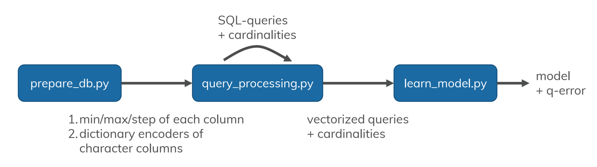

Cardinality Estimation with Local Deep Learning Models
====

This repository contains the code to reproduce the local deep learning models from [1][2].
The repository contains the following python files:

* **prepare_db.py** for setting up the local context in your db and gather meta information about it.
* **query_processing.py** for sampling and vectorizing queries and getting their true cardinality.
* **learn_model.py** train and test the local deep learning model.

The first script generates a joined table from the chosen base tables (see config.json). It also gathers the ranges of each column and dictionary-encodes all columns of type character. The query processing file samples a given number of queries from your db with cardinality larger than 0. After sampling, it vectorizes the queries as proposed in [1]. You can just use the vectorizer on a given `query_file` by calling the script with `python query_processing.py -v 1`. The final script trains a neural network for cardinality estimation. The communication between these files can be seen as a flow chart.


Additionally, there is a configuration file called **config.json**. It contains all parameters for your setup.
```
{
    "dbname": "imdb", # name of your db, this will be used as a suffix to name all files
    "vector_file": "vectors_imdb.npy", # file name of the vectorized query output incl. cardinalities
    "query_file": "queries_imdb.csv", # file name of the SQL queries incl. cardinalities
    "model_file": "model.h5", # file name for model, supports .h5 and .pb
    "number_of_queries": 105000, # number of queries to  be sampled
    "tables": ["title", "movie_info"], # tables of the local context...
    "join_ids": [["id", "movie_id"]], # ... and their join keys
    "columns": ["imdb_index", "kind_id", "production_year", 
                "phonetic_code", "episode_of_id", "season_nr", 
                "episode_nr", "info_type_id"], # columns you want to use from the original data
    "model_depth": 2, # number of layers in the neural network
    "model_width": 512, # number of neurons in the first layer (funnel architecture)
    "test_size": 5000, # number of queries in the test sets
    "runs": 5, # number of test runs (k-fold cross-validation)
    "view_name": "tmpview", # name for the intermediate table for query sampling
    "optim": 1 # whether the optimization from [2] should be used
}
```

## References

[1] [Woltmann et al., Cardinality estimation with local deep learning models, aiDM 2019](https://dl.acm.org/citation.cfm?id=3329875)
[2] [Woltmann et al., Machine Learning-based Cardinality Estimation in DBMS on Pre-Aggregated Data, arXiv 2020](https://arxiv.org/abs/2005.09367)

## Cite

Please cite our papers if you use this code in your own work:
```
@article{woltmann2019localdeep,
  title = {Cardinality estimation with local deep learning models},
  author = {Woltmann, Lucas and Hartmann, Claudio and Thiele, Maik and Habich, Dirk and Lehner, Wolfgang},
  booktitle = {Proceedings of the Second International Workshop on Exploiting Artificial Intelligence Techniques for Data Management},
  series = {aiDM '19},
  year = {2019}
}

@article{woltmann2020cube,
  title={Machine Learning-based Cardinality Estimation in DBMS on Pre-Aggregated Data},
  author={Woltmann, Lucas and Hartmann, Claudio and Habich, Dirk and Lehner, Wolfgang},
  journal={arXiv preprint arXiv:2005.09367},
  year={2020}
}
```
